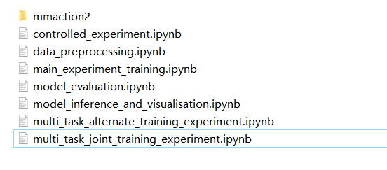
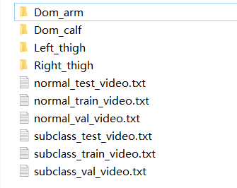
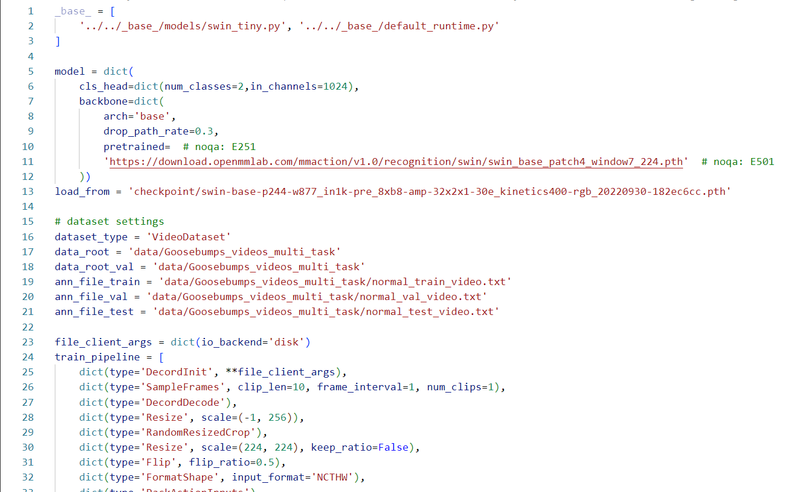
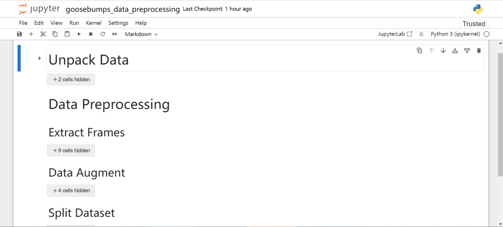
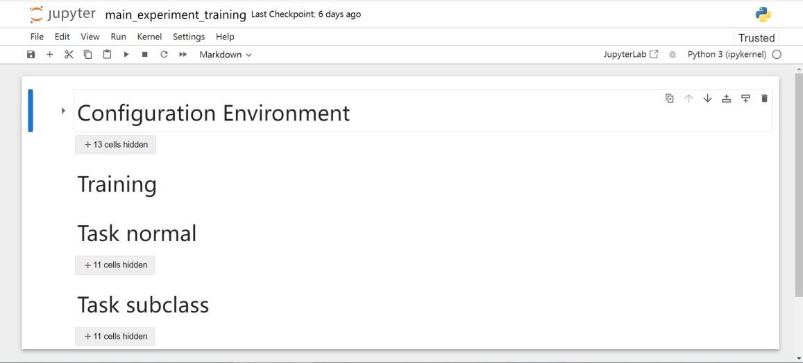
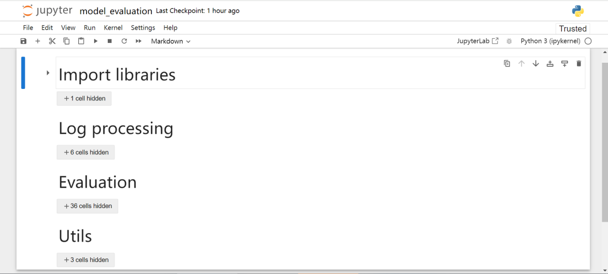
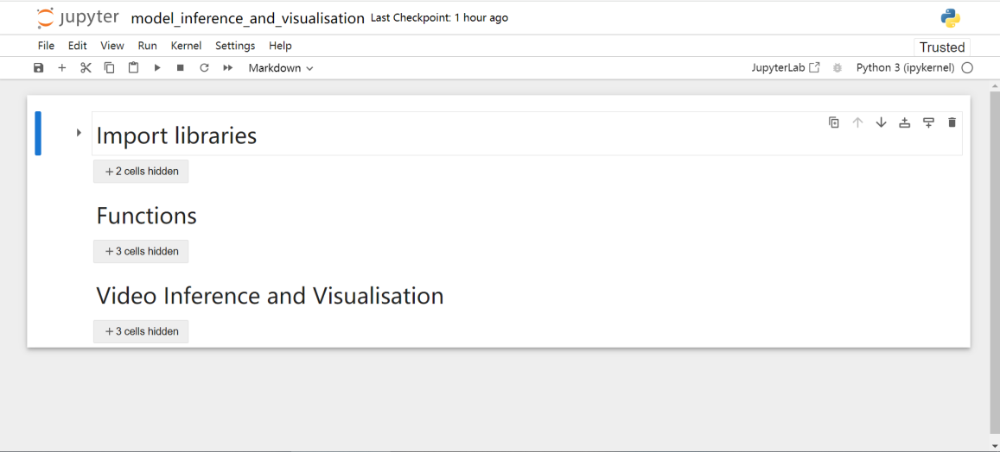

User Manual
1 Project Files Structure Introduction
This project is developed using the mmaction toolkit. As shown in the Figure 20, the project consists of several script files in ipynb format and mmaction2 folders. When using this system, just run the script files directly.

*Figure 20: Project Files Structure.*

In the mmaction2 folder, the following folders need to be paid attention to:

Data folder
The path is: /mmaction2/data. Put the preprocessed data and label files in this folder. Figure 21 shows the data folder in the experiments of the project. Note: check the relative path in the label file. Use / in Linux and \ in Windows.

*Figure 21: Data Folder in The Experiments.*

Due to file size restrictions of NESS, this project removed data when submitted.

Configuration files
The path is: /mmaction2/configs/recognition/swin. The configuration files of the models are stored in here. As shown in the Figure, set the data path and detailed training settings in the configuration file.

*Figure 22: The Config File of the Task Normal.*

Working folder
The path is: /mmaction2/work_dirs. Stores training logs, model checkpoints, etc here.
2 Data Preprocessing
As shown in the Figure 23, run all the code cells in the goosebumps_data_preprocessing.ipynb file. Note: set and modify the data path.

*Figure 23: Scripts of Data Preprocessing.*

3 Model Training
If the model needs to be re-trained, run main_experiment_training.ipynb, as shown in the Figure 24.

*Figure 24: Scripts of Model Training.*

4 Model Evaluation
To evaluate the model, run model_evaluation.ipynb, as shown in the Figure 25.

*Figure 25: Scripts of Model Evaluation.*

5 Model Inference and Visualisation
As shown in Figure 26, to use the trained model for inference and display the visualisation results, run all the codes in model_inference_and_visualisation.ipynb unit by unit. The visualisation of the results of the experiment is in:
/mmaction2/inference_result_visualization_videos.

Note: set the input and output paths of the video.

*Figure 26: Scripts of Model Inference and Visualisation.*

-----------------------------------------------------------------
Due to file size restrictions of NESS, the trained models can be downloaded from here:

https://drive.google.com/drive/folders/1sKRlUEbRWIKDUV1J9KU0HsDGMZcpzdgS?usp=sharing

-------------------------------------------------------------------------------------------------------------------------

The visualisation videos of the inference results can be downloaded from here:

https://drive.google.com/drive/folders/108GxlYUOYss_t-Fw84tlacX4DhEG0FA3?usp=sharing

